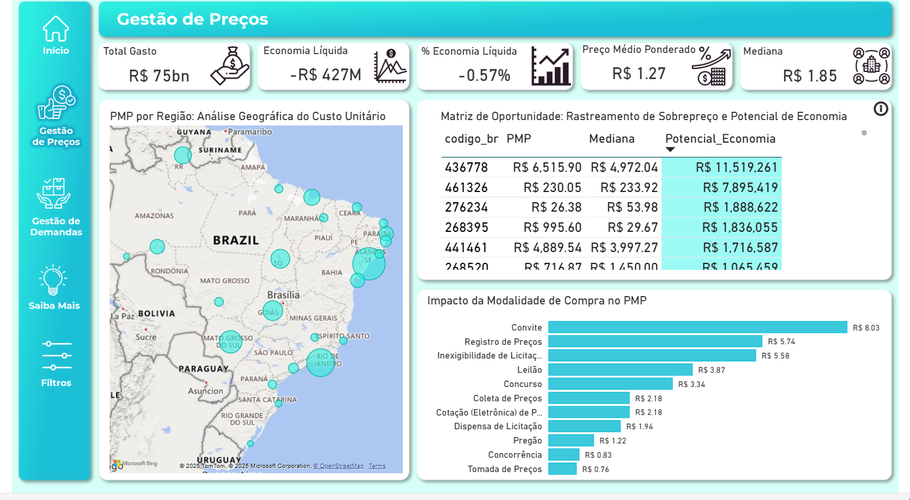

#  Pipeline ETL/ELT Profissional: Inteligência de Risco em Compras Públicas de Medicamentos

O objetivo principal deste projeto é transformar dados públicos brutos e não estruturados de aquisições de medicamentos (2020-2025) em um Data Mart Analítico (Star Schema).

O pipeline de Engenharia de Dados em Python aborda desafios como inconsistência de encoding, desvios de tipagem e a alta redundância de dados, entregando:

Governança de Dados: Implementação de um Star Schema (fato_compras e dimensões), garantindo alta performance para consultas em ferramentas de BI (Power BI/Tableau).

Análise de Risco: Cálculo de métricas avançadas (Feature Engineering) como o PMP Mediano Dinâmico, Z-Score de Risco e Índice de Priorização, permitindo identificar transações com sobrepreço e riscos na cadeia de suprimentos.

Reprodutibilidade: Orquestração completa via main.py com alta modularidade.


---

##  1. Visão Geral e Justificativa Estratégica

Este projeto implementa um **Pipeline de Engenharia de Dados (ETL)** robusto para transformar dados brutos e inconsistentes de Compras Públicas de Medicamentos (OpenDataSUS - BPS, 2020-2025) em um **Data Mart Analítico (Star Schema)**.

O objetivo estratégico é fornecer à gestão pública indicadores acionáveis de **Risco, Economicidade e Demanda**, essenciais para auditoria de preços e planejamento de suprimentos.

---

##  2. Visualização e Resultados (Dashboard)

O produto final do pipeline é um conjunto de arquivos CSV (Star Schema) otimizado para o Power BI, resultando em um dashboard de alta performance para a tomada de decisão.

###  Acesse o Dashboard Online

[](https://app.powerbi.com/view?r=eyJrIjoiNzA5NWQzYjQtMGFhOS00MzU4LThhNWEtMGFhMTZjNmU2Y2ZmIiwidCI6IjY1OWNlMmI4LTA3MTQtNDE5OC04YzM4LWRjOWI2MGFhYmI1NyJ9)
*(Clique para explorar a análise completa de risco e oportunidade.)*

###  Screenshots Principais do Painel Analítico

| Análise Principal | Screenshot |
| :--- | :--- |
| **Visão Gerencial de Preços** | [](assets/pictures/visao_gerencial_precos.png) |
| **Radar de Oportunidades** | [](assets/pictures/Radar_Oportunidades.png) |
| **Visão Gerencial de Demanda** | [](assets/pictures/visao_gerencial_demanda.png) |
| **Painel de Risco de Preço** | [](assets/pictures/Visao_Risco_Preco.png) |

---

##  3. A Solução Técnica: Pipeline ETL & Feature Engineering

O foco técnico do projeto está na **qualidade dos dados** e na **geração de indicadores avançados** de gestão, aplicando o ciclo **CRISP-DM** completo (Documentado na pasta `Notebooks/`).

| Fase | Objetivo Central | Módulos Envolvidos |
| :--- | :--- | :--- |
| **ETL (Limpeza)** | Consolidar dados (2020-2025), corrigindo *schemas* instáveis, *encodings* e erros de formatação regional (R$). | `etl_compras_antigos.py`, `etl_compras.py` |
| **Modelagem (Feature Engineering)**| Gerar indicadores estatísticos de risco de preço (**Z-Score**) e intermitência de demanda. | `modelagem_dim.py` |
| **Deployment (Carga Final)** | Entregar o produto final (**Star Schema**) pronto para consumo em BI (Power BI/Tableau). | `main.py`, `dimensoes.py` |

### **Indicadores de Gestão (Key Features):**

* **Z-Score de Risco:** Identifica transações com preços estatisticamente desviantes em relação ao *benchmark* do mercado.
* **Economia Potencial:** Quantifica o valor em R$ da oportunidade de economia em cada linha de compra.
* **Risco de Intermitência:** Mede a estabilidade da demanda por produto para gestão de estoque.
* **Concentração de Fornecedor:** Alerta sobre a dependência de fornecedores únicos (Risco de Suprimento).

---

##  4. Stack Tecnológico e Reprodutibilidade

| Categoria | Tecnologia | Uso no Projeto |
| :--- | :--- | :--- |
| **Linguagem Principal** | Python 3.10+ | Lógica de ETL e Modelagem. |
| **Processamento de Dados** | Pandas, NumPy | Limpeza de dados, manipulação de DataFrames e cálculos estatísticos (Z-Score, PMP Mediano). |
| **Orquestração** | `main.py` + `argparse` | Ponto de entrada único para execução do *pipeline* completo e flexibilidade de comandos (`--apenas-analises`). |
| **Saída Analítica** | CSV (UTF-8-SIG e separador `;`) | Formato otimizado para importação direta e performática no Power BI, garantindo compatibilidade com caracteres especiais. |

### Estrutura do Repositório

### Estrutura do Repositório e Funções Principais

A arquitetura do projeto segue um padrão modular com foco na separação de responsabilidades (ETL, Modelagem e Carga Dimensional).

| Arquivo/Pasta | Tipo | Função no Pipeline |
| :--- | :--- | :--- |
| **`main.py`** | Script |  **Orquestrador Central** (Ponto de Entrada): Coordena o fluxo completo (ETL -> Modelagem -> Carga). |
| **`src/`** | Diretório | Contém a lógica de transformação do projeto. |
| **`src/etl_compras*.py`** | Módulo | Rotinas robustas de limpeza, tratamento de encoding e consolidação dos dados de compras. |
| **`src/modelagem_dim.py`**| Módulo | **Feature Engineering**: Criação de métricas de risco (Z-Score, PMP Mediano, Risco de Intermitência). |
| **`src/dimensoes.py`** | Módulo | Responsável pela carga final do **Star Schema** (criação e salvamento das Tabelas Fato e Dimensões). |
| **`Notebooks/`** | Diretório | Contém toda a **documentação do ciclo CRISP-DM** e validações técnicas do projeto. |
| **`data/raw/`** | Diretório | **Input (Origem)**: Armazena os arquivos CSV brutos do OpenDataSUS. |
| **`data/outputs/`** | Diretório | **Output (Deployment)**: Armazena o Star Schema (Fato e Dimensões) final para o BI. |

##  5. Como Executar o Projeto

Para replicar e executar o pipeline completo, siga os passos abaixo no terminal/Git Bash.

### 5.1. Pré-requisitos

1.  Python 3.10+ instalado.
2.  Gerenciador de pacotes `pip`.
3.  **Dados Brutos:** Arquivos `.csv` originais do OpenDataSUS salvos na pasta `data/raw/`.

### 5.2. Instalação das Dependências

Crie um ambiente virtual (recomendado) e instale as bibliotecas:

```bash
python -m venv venv
source venv/bin/activate  # Linux/macOS
# ou
.\venv\Scripts\activate   # Windows

pip install pandas numpy
```

### 5.3 Execução do Pipeline

| Objetivo | Comando | 
| :--- | :--- |
| **Pipeline Completo (ETL + Modelagem + Carga)** | python main.py | 
| **Execução Acelerada (Apenas Análises)** | python main.py --apenas-analises |


## 6. Próximos Passos (Roadmap de Evolução)

O sistema está pronto para produção, mas o roadmap de evolução foca em automação e inteligência:

- Integração com APIs: Automação da coleta de dados de referência (ex: CMED) via API para reduzir dependência de CSVs estáticos.

- Winsorização Dinâmica: Caso o projeto evolua para fontes de dados em tempo real, recomenda-se implementar winsorização automática no Python para adaptar limites  estatísticos conforme a distribuição dos dados muda

            Para Dados Estáticos (Cenário Atual):
            Limite fixo no DAX (Z-Score ≤ 6) - Solução atual otimizada

            Para Dados Dinâmicos via API (Futuro):
            - Winsorização automática no Python (`modelagem_dim.py`)
            - Adaptação contínua dos limites baseada em percentis estatísticos
            - Monitoramento de drift de distribuição

- Módulo de IA: Inclusão de recursos de Inteligência Artificial Generativa para auxiliar o usuário na interpretação de outliers e legislação.

- Monitoramento: Criação de uma página de auditoria e controle para monitorar a performance do pipeline e dos indicadores de auditoria.

- Análise de Ociosidade: Criar uma página dedicada no Dashboard para visualizar a Ociosidade.

    Objetivo: Criar oportunidade de revisão do catálogo de produtos e a descontinuação de itens obsoletos. Avaliar parcerias estratégicas e aumentar a competitividade".

        Insights Chave para o Dashboard:

        - 47.6% dos produtos (10.114 itens) não foram comprados no período. 

        - 35.1% dos fornecedores (1.685 entidades) estão inativos.

        Os achados de ociosidade validam a Regra de Pareto, na página de Gestão da Demanda do dashboard, onde os produtos são avaliados pelo total gasto. Apenas 11.143 produtos concentram R$ 75,2 Bilhões em gastos.
